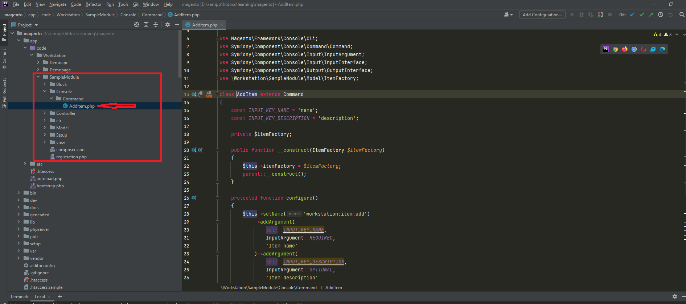

### Console command


Command create, however, to run the command run the following command:
```
php bin/magento workstation:item:add "Item-1" "Sample description 1"
```
It will insert a record into the table ("workstation_sample_item").
