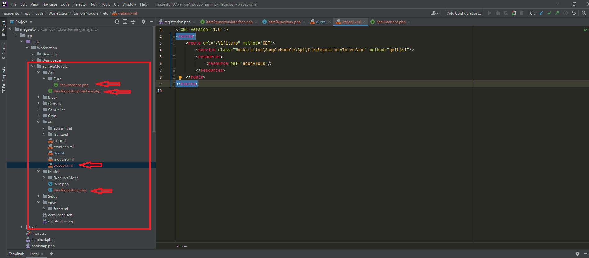

### Create rest API



<br/>
URL link for the get items:
```
http://localhost/learning/magento/rest/default/V1/items

OUTPUT:
[
    {
        "name": "Item-3",
        "description": "Sample description 3"
    },
    {
        "name": "Item-2",
        "description": "Sample description 2"
    },
    {
        "name": "Item-1",
        "description": "Sample description 1"
    },
    {
        "name": "Scheduled item",
        "description": "Created at 1629299035"
    },
    {
        "name": "Scheduled item",
        "description": "Created at 1629299055"
    } 
]
```
