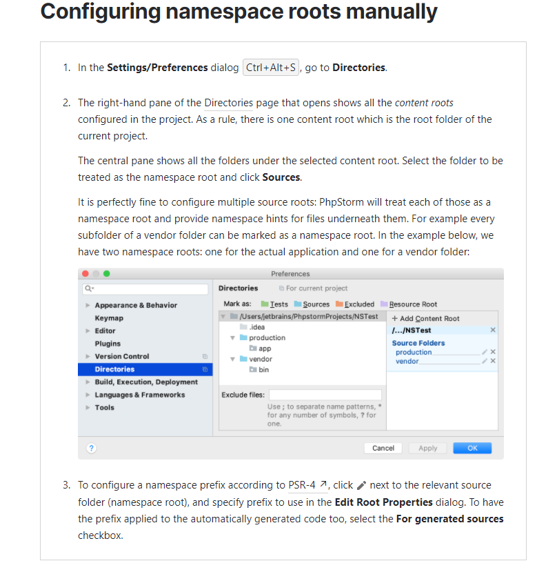
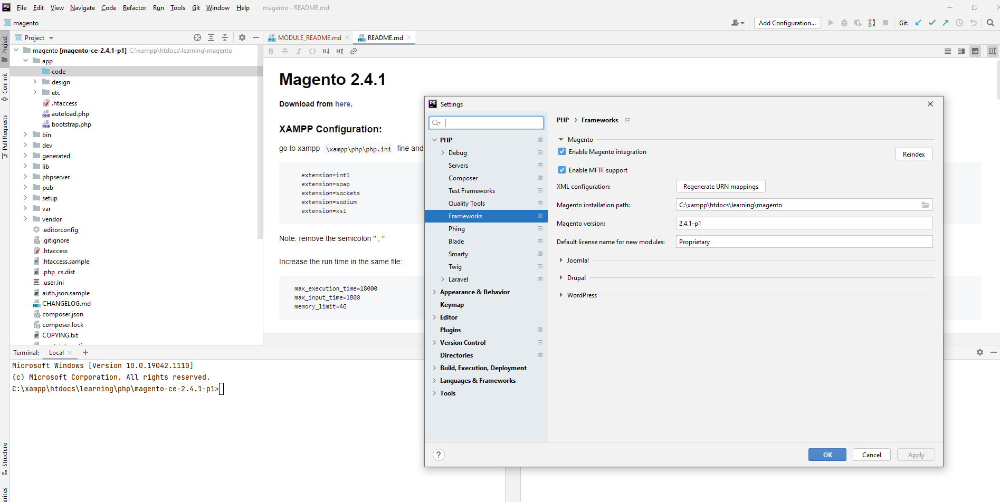

# Magento 2.4.1
#### Download from [here](https://magento.com/tech-resources/download).

### XAMPP Configuration:
go to xampp ``` \xampp\php\php.ini``` fine and and enable the following extensions :
```
    extension=intl
    extension=soap
    extension=sockets
    extension=sodium
    extension=xsl
```
Note: remove the semicolon " ; "
<br />
<br />
Increase the run time in the same file:
```
  max_execution_time=18000
  max_input_time=1800
  memory_limit=4G  
```
### Elasticsearch
In megento latest version elasticsearch is required. Download 
from [here](https://www.elastic.co/downloads/elasticsearch).
<br />
After downloading copy the downloaded file into ``` \htdocs\ ``` folder and dobble click on
```elasticsearch\bin\elasticsearch   (Windows Batch File)``` and check ```http://localhost:9200/``` 
if there is json response like : 
```
    {
      "name" : "DESKTOP-NGJBLB1",
      "cluster_name" : "elasticsearch",
      "cluster_uuid" : "7aQ8SR6pRzWYcPabihYgtA",
      "version" : {
        "number" : "7.13.3",
        "build_flavor" : "default",
        "build_type" : "zip",
        "build_hash" : "5d21bea28db1e89ecc1f66311ebdec9dc3aa7d64",
        "build_date" : "2021-07-02T12:06:10.804015202Z",
        "build_snapshot" : false,
        "lucene_version" : "8.8.2",
        "minimum_wire_compatibility_version" : "6.8.0",
        "minimum_index_compatibility_version" : "6.0.0-beta1"
      },
      "tagline" : "You Know, for Search"
    }
```
If you get the json response like this then dont close the window and keep continue the next steps.


### Install magento:
The downloaded megento 2.4.1 move to ``` \htdocs\ ``` and change the following:
<br />
```In the project directory find the following file and change the code:```
#### Step 1: 
```
    - vendor\magento\framework\Image\Adapter\G2d.php 
    - line # 86
    - change the following method (validateURLScheme) 
    
    private function validateURLScheme(string $filename) : bool
    {
       $allowed_schemes = ['ftp', 'ftps', 'http', 'https'];
       $url = parse_url($filename);
       if ($url && isset($url['scheme']) && !in_array($url['scheme'], $allowed_schemes) && !file_exists($filename)) 
        {
           return false;
         }
       return true;
    }
```

#### Step 2: 
```
    - vendor\magento\framework\View\Element\Template\File\Validator.php
    - line # 138
    $realPath = str_replace('\\', '/',$this->fileDriver->getRealPath($path));
```

#### Step 3: 
```
    - vendor\magento\framework\Interception\PluginListGenerator.php
    - line # 158
    $cacheId = implode(‘-’, $this->scopePriorityScheme) . “-” . $this->cacheId;
```

#### Step 4:
Open the terminal at the project root directory then edit the database, project baseURL etc and past the following: 
```
    php bin/magento setup:install --base-url="http://localhost/learning/php/magento/" --db-host="localhost" --db-name="magento24" --db-user="root" --db-password="" --admin-firstname="admin" --admin-lastname="admin" --admin-email="user@example.com" --admin-user="admin" --admin-password="Admin@123456" --language="en_US" --currency="USD" --timezone="America/Chicago" --use-rewrites="1" --backend-frontname="admin" --search-engine=elasticsearch7 --elasticsearch-host="localhost" --elasticsearch-port=9200 
```
#### Step 5:
Run all following commands:
```
    php bin/magento indexer:reindex
    php bin/magento setup:upgrade
    php bin/magento setup:static-content:deploy –f  
    php bin/magento deploy:mode:set developer 
    php bin/magento module:disable Magento_TwoFactorAuth
    php bin/magento cache:clean 
    php bin/magento cache:flush
    
    Config web services
    php bin/magento cache:clean config_webservice

```

#### Step 6:
Go to megento folder and then 
``` /app/etc/di.xml ```
Open the file and search ``` Copy ``` and just one line over there is
``` Symlink``` So replace ``` Symlink``` to  ``` Copy ```  then
all icons and image will be not showing any problem.

### PhpStorm


<br />
If getting problem with namespace then make code folder as root 


Enable the plugin for this project and show the project directory


