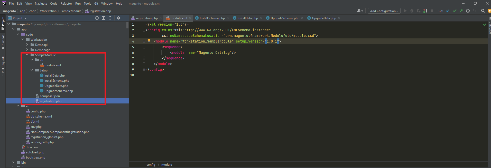

### Database schema create and update with demo data

### Database schema will be updated only when changed the setup_version (goes up) of module.xml file
 
EX : If setup_version is default 1.0.0 then if we would like to update schema then change it to 1.0.1, then it will update.
